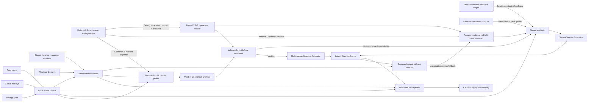

# Architecture

## Design goals

1. Keep audio math deterministic and testable without Windows, an audio device, or a UI.
2. Keep Windows integration at the edges: WASAPI capture, top-level windows, screen enumeration, Steam discovery, and global hotkeys.
3. Represent uncertainty honestly. Stereo candidates are a set, not a fabricated single answer.
4. Leave a stable boundary for automatic best-available stereo and multichannel estimators.
5. Keep the overlay non-activating and click-through so normal game input is unaffected.

## Projects

### `SoundDirectionVisualizer.Core`

Targets plain `net9.0` and has no UI or NAudio dependency.

- `StereoRmsAnalyzer` converts supported interleaved sample formats to L/R RMS levels.
- `MultichannelSignalAnalyzer` decodes every channel in a recognized layout, calculates per-channel RMS, a stereo energy fold-down, and least-squares side/rear independence from the front channels.
- `ChannelLayout`, `ChannelLevels`, and `ChannelLevelSmoother` provide the platform-independent 5.1/7.1 analysis boundary.
- `MultichannelContentValidator` requires bounded, material, independently informative side/rear observations before enabling richer direction.
- `StereoLevelSmoother` applies exponential smoothing.
- `AdaptiveStereoCalibration` scales the silence gate to endpoint level and learns a bounded stereo-width model from active frames.
- `AdaptiveLoudnessClassifier` compares active combined RMS levels with a rolling recent-ambience median and labels short level excursions without identifying their semantic source.
- `StereoDirectionEstimator` maps L/R levels to zero, one, or two azimuth candidates.
- `MultichannelDirectionEstimator` maps non-LFE speaker energy to nominal horizontal vectors and preserves multiple candidates when the resultant is underdetermined.
- `DirectionTrail` stores and expires timestamped candidates.

### `SoundDirectionVisualizer.App`

Targets `net9.0-windows` with WinForms.

- `AudioCaptureService` owns the selected/default stereo endpoint, the bounded automatic multichannel process probe, debug-forced multichannel source capture, manual process capture, promotion/fallback transitions, independent analysis state for concurrent sources, and NAudio-to-core format translation.
- `ProcessLoopbackFormatSupport` constructs 7.1/5.1 `WAVEFORMATEXTENSIBLE` float requests and validates observed masks before core analysis.
- `DirectionOverlayForm` draws the click-through compass, current candidates, and history.
- `GameWindowMonitor` identifies Steam game windows and their displays, including processes whose full module metadata is restricted by anti-cheat software.
- `GameAudioProcessResolver` selects an active audio-session process from the detected Steam game's installation directory when launcher, anti-cheat, and game audio use different processes.
- `CenteredGameAudioFallbackDetector` recognizes a sustained audible front/back-only result and requests process capture without maintaining per-game rules.
- `SoundDirectionVisualizerApplicationContext` coordinates audio, overlay, tray UI, hotkeys, settings, display changes, and app lifetime.
- `SettingsStore` persists normalized JSON settings under `%AppData%`.

The settings surface uses a dark, card-based WinForms visual system with a cyan accent derived from the application icon. The icon reduces the active overlay to a compact direction ring and a mirrored pair of prominent markers, retaining the stereo front/back ambiguity even at notification-area sizes. Audio, overlay, targeting, live status, and hotkey controls remain separated into tabs; the notification-area menu uses the same palette. The Status tab presents the immutable capture status and the newest 100 reasoned capture events from a session-only in-memory queue. In debug-force mode it also renders an immutable aggregate-only channel-level frame for every channel in the active stream, including diagnostic LFE, and hides that card in normal operation. The visual theme does not change the overlay window styles or the deterministic analysis boundary.

### `SoundDirectionVisualizer.Core.Tests`

Exercises stereo and multichannel direction mapping, every-channel decoding, malformed buffers, 5.1/7.1 layouts, duplicated/upmixed-content rejection, validation transitions, silence behavior, fallback status, and trail expiry.

## Runtime flow

NAudio invokes each recorder's data callback on its capture thread. Endpoint stereo and a temporary process probe have independent smoother, calibration, loudness, and validator state. Before verification only endpoint direction frames are published. Verification atomically suppresses endpoint frames, publishes multichannel frames, and stops the endpoint recorder on a separate transition task; rejection stops the probe and leaves endpoint publication unchanged. `AudioCaptureService` raises `FrameAvailable` after direction and loudness analysis and separately raises `ChannelLevelsAvailable` with a copied immutable aggregate level frame. The application context only replaces locked references in either callback. A 33 ms WinForms timer transfers the latest direction frame to the overlay and, when debug force and the settings window are active, the latest non-stale channel frame to Status. Painting, accessibility text, and trail mutation therefore remain on the UI thread; raw audio buffers never cross that boundary.

`GameWindowMonitor` includes the detected process ID, executable path, and Steam game installation directory in its target result. Executable paths are queried with `PROCESS_QUERY_LIMITED_INFORMATION` before falling back to managed `Process.MainModule`; this permits normal path verification for protected processes such as DayZ's BattlEye-launched game process without bypassing or modifying anti-cheat behavior.

The default path captures the configured output endpoint, or the current Windows multimedia output when no explicit endpoint is selected. After eight seconds without an audible frame, `SilentEndpointProbeSchedule` permits a background peak-meter scan of the other active render endpoints. The scan only considers endpoints whose shared-mode mix format is stereo and whose peak exceeds a small activity floor. Unsuccessful scans use exponential backoff capped at 30 seconds, and a successful scan switches the single loopback capture rather than keeping parallel captures alive. The automatic endpoint choice is temporary and does not overwrite the saved default-device selection.

With best-available audio enabled, `GameAudioProcessResolver` selects the strongest active same-installation process and `AudioCaptureService` temporarily runs a process probe beside the endpoint. It requests 48 kHz 32-bit float 7.1, then 5.1 after an activation failure, using the same process-tree `ActivateAudioInterfaceAsync` path as stereo process capture. Only exact standard masks with matching channel counts proceed. The platform-independent validator promotes after three material side/rear observations whose waveforms retain energy after least-squares projection onto every front channel. A negative decision requires at least 32 active buffers across eight seconds, and a separate 12-second task expires silent or sparse probes. Verification promotes that recorder; timeout, malformed data, copied/upmixed content, or activation failure retains endpoint stereo. The application context schedules rejected endpoint-side probes again after 30 seconds with exponential backoff capped at five minutes and calls the service's serialized retry path, which leaves the primary endpoint recorder running. Status changes are immutable records marshalled to the UI thread and include source, requested/observed layout, estimator, validation state, and fallback reason.

`DetectedGameAudioCaptureModeResolver` gives the disabled-by-default debug force policy priority only after a game audio process has been resolved. The service then requests the same recognized 7.1/5.1 formats without starting endpoint capture in parallel. Successful format activation immediately publishes the all-channel stereo fold-down and status identifies the source as forced; content verification may later enable the multichannel estimator. Uninformative content leaves the forced recorder and stereo estimator active together. Activation failure starts endpoint stereo, marks the forced source unavailable, and lets the existing retry scheduler make another serialized forced attempt. Status and session events distinguish source selection from estimator confidence throughout this path.

When the automatic centered-output fallback is enabled and a Steam game is detected, `CenteredGameAudioFallbackDetector` observes endpoint-capture direction frames. It requests game-process capture only after at least 32 audible front/back candidate frames span eight seconds with absolute balance no greater than `0.0025`. Any lateral audible frame resets the interval, as does an audio gap longer than two seconds. The fallback is a runtime state rather than a change to the manual process-capture setting. It remains stable for that detected game to avoid source oscillation, resets when the game changes or exits, and can be disabled entirely through its own Audio-tab setting. Detection is content-based and applies to every Steam game without a compatibility list.

When manual or centered-fallback process capture is active, the same multichannel negotiation runs as the primary source. Pending or uninformative layouts are folded to stereo from all non-LFE channel energies and keep mirrored front/back candidates. If both multichannel activations fail, native stereo process capture is attempted; endpoint stereo remains the terminal fallback if that also fails. All source transitions reset smoothing, loudness classification, adaptive calibration, validation, and centered-output observation so state from one process or device is not reused for another.

The application pins `NAudio.Wasapi` `3.0.0-preview.20` because its recorder API provides the Windows process-loopback activation used here. The exact version is intentional; migration to a stable NAudio 3 release should be tested as an explicit dependency change.

## Overlay window behavior

The form is borderless, topmost, excluded from the taskbar, and created with:

- `WS_EX_LAYERED` for transparent-window behavior;
- `WS_EX_TRANSPARENT` so mouse hit testing passes through;
- `WS_EX_TOOLWINDOW` to keep it out of normal app switching UI;
- `WS_EX_NOACTIVATE` and `MA_NOACTIVATE` so it does not steal focus.

The form is only large enough to contain the compass rather than covering the entire display. Its center is calculated from the target display plus the configured X/Y offsets.

The transparency key background and all visible geometry are painted with opaque colors so GDI+ cannot blend the chosen color with the chroma key. The WinForms window `Opacity` property controls the complete overlay's percentage transparency. Whole-overlay size is calculated in the platform-independent core as a percentage of the current target display height and applies to radius, line width, markers, listener point, tick marks, labels, and window padding together. The default size is 110% of the target display height.

Rendering is split into independently enabled layers: compass ring, cardinal ticks, current direction rays, current direction markers, listener dot, fading history trail, and compass labels. A master overlay toggle controls the window without changing the individual layer selections. Marker size and visual intensity are calculated deterministically from freshness and loudness. Ambient and loud markers each apply their own size percentage, fill color, and relative opacity to both current and trail layers. Ambient trail and current markers are drawn before the loud trail and current marker passes, guaranteeing that loud markers remain above ambient markers even across current/history boundaries. A current marker uses the same type-specific result as a fresh trail point, while trail age shrinks and fades both types. Loud markers can additionally use a separately colored outline whose base thickness is stored and edited at 0.1 px precision before whole-overlay display scaling is applied.

## Display targeting

Automatic targeting follows this priority:

1. still-valid cached foreground Steam game;
2. current foreground window if its executable is in a Steam library;
3. still-visible cached game window;
4. a throttled full process scan;
5. unchanged current display when nothing is detected.

Steam containment uses path-relative directory checks rather than string-prefix checks, so a similarly named sibling directory cannot be mistaken for a game under `steamapps\common`. The first directory below `common` is retained as the game-install boundary for same-game audio-session selection.

Foreground changes trigger a refresh through a WinEvent hook. A two-second timer provides recovery from missed events, process startup races, and display changes. Manual cycling disables automatic display targeting intentionally, while game detection can remain active for best-available probing, manual process capture, or the automatic centered-output fallback.

## Extension points

The core now exposes both `StereoLevels` and channel-layout-aware `ChannelLevels`, while both estimators return `DirectionEstimate.CandidateAzimuths`. The overlay and history therefore do not know whether a result came from stereo or verified process-loopback 5.1/7.1.

The next audio phase can reuse `ChannelLayout`, `MultichannelSignalAnalyzer`, `MultichannelContentValidator`, `MultichannelDirectionEstimator`, and `AudioCaptureStatus` for native multichannel endpoints. It must compare demonstrated directional value rather than channel count and keep stereo as the terminal fallback. A later optional virtual endpoint and any dismissible spatial-sound recommendation must also reuse this policy instead of making system configuration mandatory.
