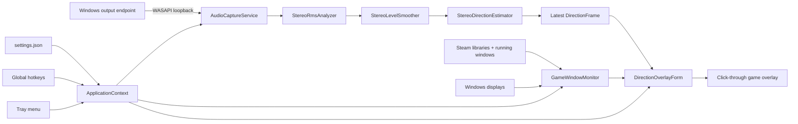

# Architecture

## Design goals

1. Keep audio math deterministic and testable without Windows, an audio device, or a UI.
2. Keep Windows integration at the edges: WASAPI capture, top-level windows, screen enumeration, Steam discovery, and global hotkeys.
3. Represent uncertainty honestly. Stereo candidates are a set, not a fabricated single answer.
4. Leave a stable boundary for future multichannel estimators.
5. Keep the overlay non-activating and click-through so normal game input is unaffected.

## Projects

### `SoundDirectionVisualizer.Core`

Targets plain `net9.0` and has no UI or NAudio dependency.

- `StereoRmsAnalyzer` converts supported interleaved sample formats to L/R RMS levels.
- `StereoLevelSmoother` applies exponential smoothing.
- `AdaptiveStereoCalibration` scales the silence gate to endpoint level and learns a bounded stereo-width model from active frames.
- `StereoDirectionEstimator` maps L/R levels to zero, one, or two azimuth candidates.
- `DirectionTrail` stores and expires timestamped candidates.

### `SoundDirectionVisualizer.App`

Targets `net9.0-windows` with WinForms.

- `AudioCaptureService` owns the NAudio WASAPI loopback session and translates NAudio formats into core sample encodings.
- `DirectionOverlayForm` draws the click-through compass, current candidates, and history.
- `GameWindowMonitor` identifies Steam game windows and their displays.
- `SoundDirectionVisualizerApplicationContext` coordinates audio, overlay, tray UI, hotkeys, settings, display changes, and app lifetime.
- `SettingsStore` persists normalized JSON settings under `%AppData%`.

### `SoundDirectionVisualizer.Core.Tests`

Exercises direction mapping, silence behavior, sample decoding, stereo-only rejection, and trail expiry.

## Runtime flow

NAudio invokes `FrameAvailable` on its capture thread. The application context only replaces a locked reference there. A 33 ms WinForms timer transfers the latest immutable frame to the overlay on the UI thread. Painting and trail mutation therefore remain on the UI thread.

## Overlay window behavior

The form is borderless, topmost, excluded from the taskbar, and created with:

- `WS_EX_LAYERED` for transparent-window behavior;
- `WS_EX_TRANSPARENT` so mouse hit testing passes through;
- `WS_EX_TOOLWINDOW` to keep it out of normal app switching UI;
- `WS_EX_NOACTIVATE` and `MA_NOACTIVATE` so it does not steal focus.

The form is only large enough to contain the compass rather than covering the entire display. Its center is calculated from the target display plus the configured X/Y offsets.

The transparency key background and all visible geometry are painted with opaque colors so GDI+ cannot blend the chosen color with the chroma key. The WinForms window `Opacity` property controls the complete overlay's percentage transparency. Whole-overlay size is calculated in the platform-independent core as a percentage of the current target display height and applies to radius, line width, markers, listener point, tick marks, labels, and window padding together. The default size is 110% of the target display height.

Rendering is split into independently enabled layers: compass ring, cardinal ticks, current direction rays, current direction markers, listener dot, fading history trail, and compass labels. A master overlay toggle controls the window without changing the individual layer selections.

## Display targeting

Automatic targeting follows this priority:

1. still-valid cached foreground Steam game;
2. current foreground window if its executable is in a Steam library;
3. still-visible cached game window;
4. a throttled full process scan;
5. unchanged current display when nothing is detected.

Foreground changes trigger a refresh through a WinEvent hook. A two-second timer provides recovery from missed events, process startup races, and display changes. Manual cycling disables automatic targeting intentionally.

## Extension points

The core currently consumes `StereoLevels`, while the UI consumes `DirectionEstimate.CandidateAzimuths`. A future multichannel implementation should introduce a channel-layout-aware level frame and a new estimator that returns the same direction result contract. The overlay and most app coordination should not need to know whether a result came from stereo, 5.1, 7.1, or a virtual endpoint.
