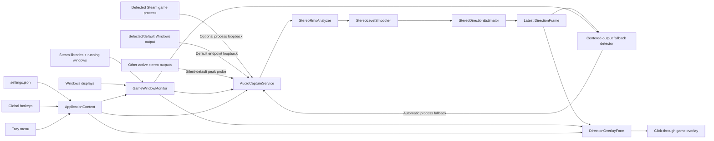

# Architecture

## Design goals

1. Keep audio math deterministic and testable without Windows, an audio device, or a UI.
2. Keep Windows integration at the edges: WASAPI capture, top-level windows, screen enumeration, Steam discovery, and global hotkeys.
3. Represent uncertainty honestly. Stereo candidates are a set, not a fabricated single answer.
4. Leave a stable boundary for automatic best-available stereo and multichannel estimators.
5. Keep the overlay non-activating and click-through so normal game input is unaffected.

## Projects

### `SoundDirectionVisualizer.Core`

Targets plain `net9.0` and has no UI or NAudio dependency.

- `StereoRmsAnalyzer` converts supported interleaved sample formats to L/R RMS levels.
- `StereoLevelSmoother` applies exponential smoothing.
- `AdaptiveStereoCalibration` scales the silence gate to endpoint level and learns a bounded stereo-width model from active frames.
- `AdaptiveLoudnessClassifier` compares active combined RMS levels with a rolling recent-ambience median and labels short level excursions without identifying their semantic source.
- `StereoDirectionEstimator` maps L/R levels to zero, one, or two azimuth candidates.
- `DirectionTrail` stores and expires timestamped candidates.

### `SoundDirectionVisualizer.App`

Targets `net9.0-windows` with WinForms.

- `AudioCaptureService` normally uses selected/default-endpoint loopback, optionally attempts detected-game process loopback, and translates NAudio formats into core sample encodings.
- `DirectionOverlayForm` draws the click-through compass, current candidates, and history.
- `GameWindowMonitor` identifies Steam game windows and their displays, including processes whose full module metadata is restricted by anti-cheat software.
- `GameAudioProcessResolver` selects an active audio-session process from the detected Steam game's installation directory when launcher, anti-cheat, and game audio use different processes.
- `CenteredGameAudioFallbackDetector` recognizes a sustained audible front/back-only result and requests process capture without maintaining per-game rules.
- `SoundDirectionVisualizerApplicationContext` coordinates audio, overlay, tray UI, hotkeys, settings, display changes, and app lifetime.
- `SettingsStore` persists normalized JSON settings under `%AppData%`.

The settings surface uses a dark, card-based WinForms visual system with a cyan accent derived from the application icon. The icon reduces the active overlay to a compact direction ring and a mirrored pair of prominent markers, retaining the stereo front/back ambiguity even at notification-area sizes. Audio, overlay, targeting, and hotkey controls remain separated into tabs; the notification-area menu uses the same palette. The visual theme does not change the overlay window styles or the deterministic analysis boundary.

### `SoundDirectionVisualizer.Core.Tests`

Exercises direction mapping, silence behavior, sample decoding, stereo-only rejection, and trail expiry.

## Runtime flow

NAudio invokes its data callback on the capture thread, and `AudioCaptureService` raises `FrameAvailable` after direction and loudness analysis on that thread. The application context only replaces a locked reference there. A 33 ms WinForms timer transfers the latest immutable frame to the overlay on the UI thread. Painting and trail mutation therefore remain on the UI thread. Loudness classification is retained in each `DirectionFrame` and copied into its `DirectionTrailPoint`, so current and delayed markers keep the same emphasis class throughout their visual lifetime.

`GameWindowMonitor` includes the detected process ID, executable path, and Steam game installation directory in its target result. Executable paths are queried with `PROCESS_QUERY_LIMITED_INFORMATION` before falling back to managed `Process.MainModule`; this permits normal path verification for protected processes such as DayZ's BattlEye-launched game process without bypassing or modifying anti-cheat behavior.

The default path captures the configured output endpoint, or the current Windows multimedia output when no explicit endpoint is selected. After eight seconds without an audible frame, `SilentEndpointProbeSchedule` permits a background peak-meter scan of the other active render endpoints. The scan only considers endpoints whose shared-mode mix format is stereo and whose peak exceeds a small activity floor. Unsuccessful scans use exponential backoff capped at 30 seconds, and a successful scan switches the single loopback capture rather than keeping parallel captures alive. The automatic endpoint choice is temporary and does not overwrite the saved default-device selection.

When the automatic centered-output fallback is enabled and a Steam game is detected, `CenteredGameAudioFallbackDetector` observes endpoint-capture direction frames. It requests game-process capture only after at least 32 audible front/back candidate frames span eight seconds with absolute balance no greater than `0.0025`. Any lateral audible frame resets the interval, as does an audio gap longer than two seconds. The fallback is a runtime state rather than a change to the manual process-capture setting. It remains stable for that detected game to avoid source oscillation, resets when the game changes or exits, and can be disabled entirely through its own Audio-tab setting. Detection is content-based and applies to every Steam game without a compatibility list.

When manual or automatically requested game-process capture is active, `GameAudioProcessResolver` enumerates active render-endpoint sessions and selects the strongest active session whose executable remains inside that same game installation. It falls back to the detected window process if session enumeration is unavailable or produces no same-game candidate. A selected audio-process change restarts capture through Windows process loopback at stereo 48 kHz float. If activation is unsupported or fails, `AudioCaptureService` starts the configured endpoint loopback instead and exposes the fallback in status without terminating the overlay. All source transitions reset smoothing, loudness classification, adaptive calibration, and centered-output observation so state from one process or device is not reused for another.

The application pins `NAudio.Wasapi` `3.0.0-preview.20` because its recorder API provides the Windows process-loopback activation used here. The exact version is intentional; migration to a stable NAudio 3 release should be tested as an explicit dependency change.

## Overlay window behavior

The form is borderless, topmost, excluded from the taskbar, and created with:

- `WS_EX_LAYERED` for transparent-window behavior;
- `WS_EX_TRANSPARENT` so mouse hit testing passes through;
- `WS_EX_TOOLWINDOW` to keep it out of normal app switching UI;
- `WS_EX_NOACTIVATE` and `MA_NOACTIVATE` so it does not steal focus.

The form is only large enough to contain the compass rather than covering the entire display. Its center is calculated from the target display plus the configured X/Y offsets.

The transparency key background and all visible geometry are painted with opaque colors so GDI+ cannot blend the chosen color with the chroma key. The WinForms window `Opacity` property controls the complete overlay's percentage transparency. Whole-overlay size is calculated in the platform-independent core as a percentage of the current target display height and applies to radius, line width, markers, listener point, tick marks, labels, and window padding together. The default size is 110% of the target display height.

Rendering is split into independently enabled layers: compass ring, cardinal ticks, current direction rays, current direction markers, listener dot, fading history trail, and compass labels. A master overlay toggle controls the window without changing the individual layer selections. Marker size and visual intensity are calculated deterministically from freshness and loudness. Ambient and loud markers each apply their own size percentage, fill color, and relative opacity to both current and trail layers. Ambient trail and current markers are drawn before the loud trail and current marker passes, guaranteeing that loud markers remain above ambient markers even across current/history boundaries. A current marker uses the same type-specific result as a fresh trail point, while trail age shrinks and fades both types. Loud markers can additionally use a separately colored outline whose base thickness is stored and edited at 0.1 px precision before whole-overlay display scaling is applied.

## Display targeting

Automatic targeting follows this priority:

1. still-valid cached foreground Steam game;
2. current foreground window if its executable is in a Steam library;
3. still-visible cached game window;
4. a throttled full process scan;
5. unchanged current display when nothing is detected.

Steam containment uses path-relative directory checks rather than string-prefix checks, so a similarly named sibling directory cannot be mistaken for a game under `steamapps\common`. The first directory below `common` is retained as the game-install boundary for same-game audio-session selection.

Foreground changes trigger a refresh through a WinEvent hook. A two-second timer provides recovery from missed events, process startup races, and display changes. Manual cycling disables automatic display targeting intentionally, while game detection can remain active solely for manual process capture or the automatic centered-output fallback.

## Extension points

The core currently consumes `StereoLevels`, while the UI consumes `DirectionEstimate.CandidateAzimuths`. The next audio phase should introduce a platform-independent, channel-layout-aware level frame and a multichannel estimator that returns the same direction result contract. The overlay and most app coordination should not need to know whether a result came from stereo, process-loopback 5.1/7.1, a native multichannel endpoint, or a later virtual endpoint.

Capture orchestration should first be extended with an automatic best-available process path. When a game audio process is available, it may request standard 7.1 and 5.1 process-loopback formats without requiring the user to install a driver, reroute audio, or change Windows settings. Negotiated channel count is only a capability signal, not evidence of improved direction data. Layout parsing and bounded content observations must distinguish useful independent side/rear information from silence, channel duplication, upmixed stereo, and otherwise stereo-derived content before the application claims a richer estimator mode.

The existing stereo process/endpoint behavior remains the terminal fallback for every failure or inconclusive result. A multichannel attempt must never silently discard extra channels, block normal visualization, remove explicit stereo front/back ambiguity, or make a Windows spatial-sound setting mandatory. The UI may offer a dismissible spatial-sound recommendation for compatible stereo systems, but the application should not change that setting itself. Later native-endpoint and virtual-device work should reuse the same layout-aware core, validation concepts, status model, and stereo fallback rather than adding competing capture policies.
